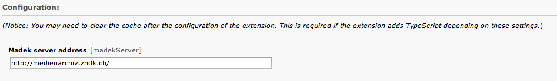
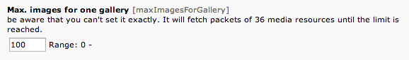

=============	
Admins manual
=============

The ZHdK MAdeK Player is a Typo3 extension which enables Typo3 users to display
a gallery with images from a user-defined MAdeK server. This plugin is designed
to be a simple client to a MAdeK server and doesn't let the user overrule any
data from MAdeK (e.g. you can't overwrite metadata or define an order).

Set up
======
Set a different media server
-----------------------------

If you want to use a different MAdeK server than
[medienarchiv.zhdk.ch](http://medienarchiv.zhdk.ch/) you must define it in the extension configuration.

Set the number of images for a gallery
---------------------------------------

In the extension configuration you can set the range.

General
======

Set a MAdeK media set
------------------

When you search for a set, you have to be sure if the set in the media server is set up as published.
You can do this in the settings **Permissions and Responsibility**.

Selections
----------

+----+------------------------+-----------------------------------------------------------+-------------------------------------------------+
|Nr. | Selection              | What it does                                              |Refers to:                                       |
+========================+================================================================+=================================================+
|1.  | Show copyright notice  | enables copyright notice in the frontend                  |Test                                             |
+----+------------------------+-----------------------------------------------------------+-------------------------------------------------+
|2.  | Show title and date    | enables the title and date in the frontend                |Field title and year of upload of the image      |
+----+------------------------+-----------------------------------------------------------+-------------------------------------------------+
|3.  | Show subtitle          | enables the subtitle of the image in the frontend         |Subtitle which are set in the settings of images |	
+----+------------------------+-----------------------------------------------------------+-------------------------------------------------+
|4.  | Show pubic caption     | enables the public caption of the image  in the frontend  |Field caption in the image metadata settings     |
+----+------------------------+-----------------------------------------------------------+-------------------------------------------------+
|5.  | Show author            | enables the author name  in the frontend                  |Field author in the image metadata settings      |
+----+------------------------+-----------------------------------------------------------+-------------------------------------------------+

+-------+----------+------+
| Table Headings   | Here |
+-------+----------+------+
| Sub   | Headings | Too  |
+=======+==========+======+
| cell  | column spanning |
+ spans +----------+------+
| rows  | normal   | cell |
+-------+----------+------+
| multi | * cells can be  |
| line  | * formatted     |
| cells | * paragraphs    |
| too   |                 |
+-------+-----------------+

Formats
======

Fields
-------

+----+-----------------------------+-----------------------------------------+--------------+
|Nr.	| Selection				| What it does                    		  |Default value |
+========================+===================================================+==============+
|1.	| Player width (pixel)		| Set the width of the player		   	  | 630px		  |
+----+-----------------------------+-----------------------------------------+--------------+
|2.	| Max. image width (pixel)	| Set the maximum width of the images	  | 620px		  |
+----+-----------------------------+-----------------------------------------+--------------+
|3.	| Max. image height (pixel)	| Set the maximum height of the images	  | 500px		  |
+----+-----------------------------+-----------------------------------------+--------------+
|4.	| No. of thumbnails per page	| Set the number of thumbnails per page   | 5	   	  |
+----+-----------------------------+-----------------------------------------+--------------+
|5.	| Background color			| Set the color of the players background | #eeeeee      |
+----+-----------------------------+-----------------------------------------+--------------+
|6.	| Border color				| Set the color of the players border	  | #dedede	  |
+----+-----------------------------+-----------------------------------------+--------------+

How to use the the color picker
------------------------

1. Click on the color picker symbol next to the background or border color field
2. Then it should appear a pop-up window, where you can select the color you prefer
3. Once selected the color press on Save and Close

