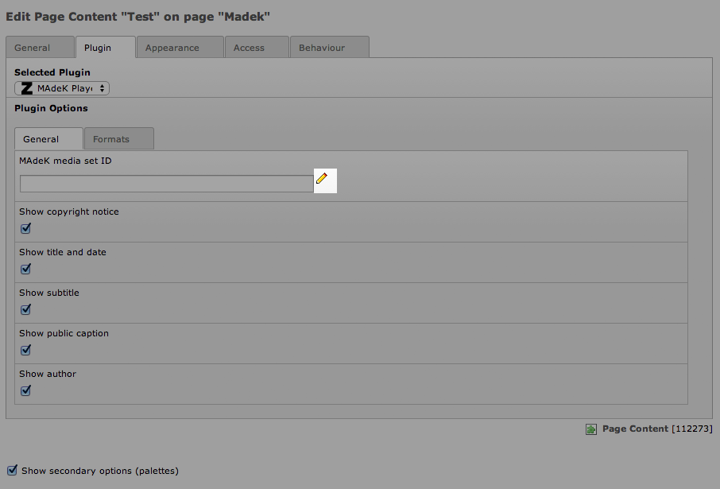

============
Users manual
============

General
======

Set a MAdeK media set
---------------------

1.	Click on the edit symbol

2.	Then it should appear a pop up window, where you can search for a MAdeK set
3.	Search for the set you want

.. image:: images/screenshot_popup_1.jpg
	:width: 800

4.	When the search is finished, select the set you wanted
	-You can only select the sets which are set up as published

Selections
----------

+------+-------------------------+-----------------------------------------------------------+
| Nr\. | Selection               | What it does                                              |
+======+=========================+===========================================================+
| 1\.  | Show copyright notice   | enables copyright notice in the frontend                  |
+------+-------------------------+-----------------------------------------------------------+
| 2\.  | Show title and date     | enables the title and date in the frontend                |
+------+-------------------------+-----------------------------------------------------------+
| 3\.  | Show subtitle           | enables the subtitle of the image in the frontend         |
+------+-------------------------+-----------------------------------------------------------+
| 4\.  | Show pubic caption      | enables the public caption of the image  in the frontend  |
+------+-------------------------+-----------------------------------------------------------+
| 5\.  | Show author             | enables the author name  in the frontend                  |
+------+-------------------------+-----------------------------------------------------------+

====================

Formats
=======

Fields
------

+------+-----------------------------+-----------------------------------------+--------------+
| Nr\. | Selection                   | What it does                            | Default value|
+======+=============================+=========================================+==============+
| 1\.  | Player width (pixel)        | Set the width of the player             | 630px        |
+------+-----------------------------+-----------------------------------------+--------------+
| 2\.  | Max. image width (pixel)    | Set the maximum width of the images     | 620px        |
+------+-----------------------------+-----------------------------------------+--------------+
| 3\.  | Max. image height (pixel)   | Set the maximum height of the images    | 500px        |
+------+-----------------------------+-----------------------------------------+--------------+
| 4\.  | No. of thumbnails per page  | Set the number of thumbnails per page   | 5            |
+------+-----------------------------+-----------------------------------------+--------------+
| 5\.  | Background color            | Set the color of the players background | #eeeeee      |
+------+-----------------------------+-----------------------------------------+--------------+
| 6\.  | Border color                | Set the color of the players border     | #dedede      |
+------+-----------------------------+-----------------------------------------+--------------+

.. image:: images/format.jpg
	:width: 800

How to use the the color picker
-------------------------------

1. Click on the color picker symbol next to the background or border color field
2. Then it should appear a pop-up window, where you can select the color you prefer
3. Once selected the color press on Save and Close

