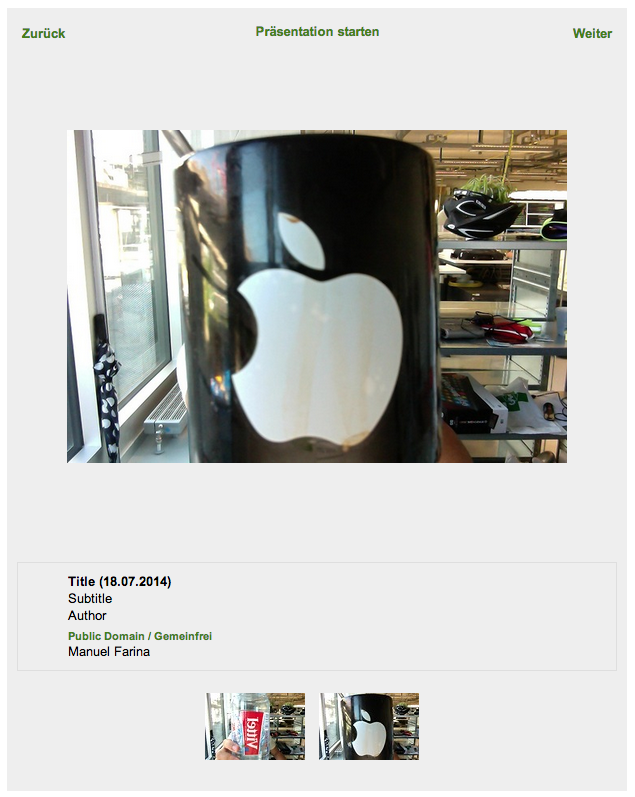

============
Introduction
============

What does it do?
================

The **ZHdK MAdeK Player** is a typo3 plugin which connects to a media server named MAdeK. The media saved as a set in the MAdeK server, is used by the player to create a simple and clear slideshow.
The plugin will only play images, because the media server delivers images only. 

The format can be set up just as one like it.

**Screenshots**

